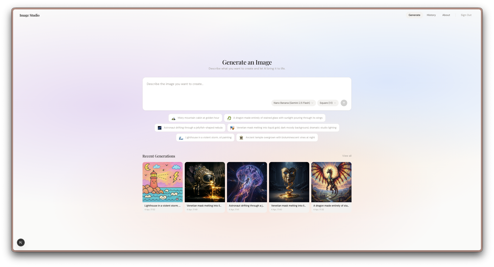
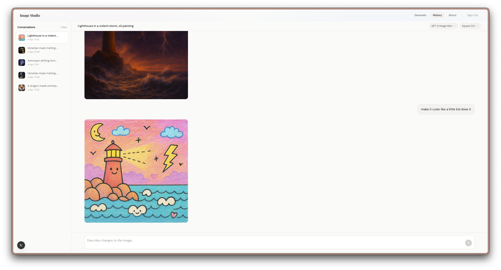

# Image Studio

An AI image generation app that lets you run the same prompt across multiple models at once (Gemini, GPT-5 Image, etc.), compare the results side by side as they stream in, and then refine any image through conversation.





## Features

- **Multi-model generation** — one prompt, multiple models, results stream in as each finishes
- **Conversational refinement** — pick an image and iterate on it through chat
- **Multiple aspect ratios** — square, landscape, portrait, ultra-wide

## Tech Stack

**Frontend:** Next.js 16, React 19, Tailwind CSS v4, TypeScript

**Backend:** Express 5, PostgreSQL + Prisma, Zod validation, JWT auth, Winston logging, rate limiting, S3 image storage

**AI:** OpenRouter API with server-sent events for real-time streaming

**Architecture:** Routes → Controllers → Services → Repositories (fully typed, Zod-validated at the boundary)

## Setup

```bash
git clone https://github.com/karimalsaka/imagestudio.git
cd imagestudio
npm install
```

Add `server/.env`:
```env
DATABASE_URL=postgresql://...
OPENROUTER_API_KEY=sk-or-...
JWT_SECRET=your-secret-key
CLIENT_URL=http://localhost:3000
S3_BUCKET_NAME=your-bucket
AWS_REGION=us-east-1
AWS_ACCESS_KEY_ID=...
AWS_SECRET_ACCESS_KEY=...
```

Add `.env`:
```env
NEXT_PUBLIC_API_URL=http://localhost:4000/api
```

```bash
npx prisma migrate deploy
npm run server   # terminal 1
npm run dev      # terminal 2
```
